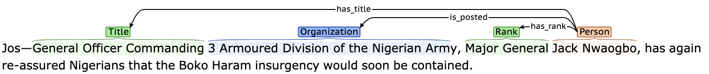
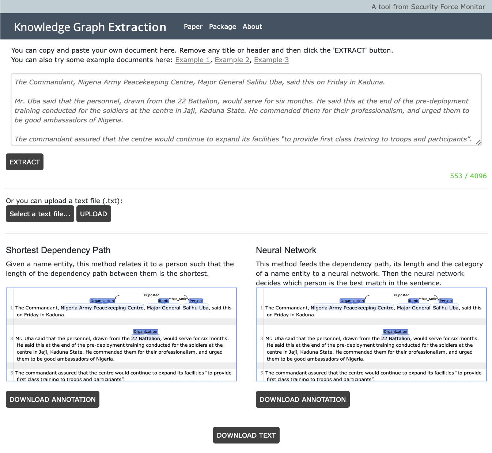

# Knowledge Graph Extraction

We designed a pipeline that can extract a special kind of knowledge graphs where a person's name will be recognized and his/her rank, role, title and organization will be related to him/her. It is not expected to perform perfectly so that all relevant persons will be recognized and all irrelevant persons will be excluded. Rather, it is seen as a first step to reduce the workload that is involved to manually extract such knowledge by combing through a large amount of documents.

This pipeline consists of two major components: Name Entity Recognition and Relation Extraction. Name Entity Recognition uses a BiLSTM-CNNs-CRF model. It recognizes names, ranks, roles, titles and organizations from raw text files. Then the Relation Extraction relates names to his/her corresponding rank, role, title or organization.

Example:


## Dependencies
Tensorflow 2.2.0 <br>
Tensorflow-addons <br>
SpaCy <br>
NumPy <br>
DyNet <br>
Pathlib <br>

## Install
Package: https://pypi.org/project/extract-sfm/
```shell
$ pip install extract_sfm
```


## Usage

### Method 1

Create a python file and write:
```python
import extract_sfm

extract_sfm.extract("/PATH/TO/DIRECTORY/OF/INPUT/FILES")
```
Then run the python file. This may take a while to finish.

### Method 2

Download this Github repository
Under the project root directory, run the python script

```shell
$ python pipeline.py /PATH/TO/DIRECTORY/OF/INPUT/FILES
```
> Note: Use absolute path.


## Website
1. Copy NER_v2, RE, pipeline.py into the "SERVER/KGE" directory
2. Install npm dependencies under the "SERVER" directory: express, path, multer
```
  $ npm install <package name>
```
3. Run the server by typing in:
```
  $ node server.js
```




## Documentation
The documentation for NER and RE is stored in: [doc.txt](doc.txt)
